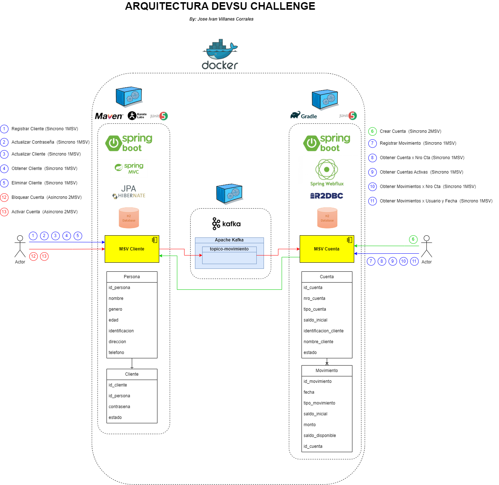

# Devsu Challenge

**Arquitectura**



**Ejecutar con Docker**

Compilar Microservicio ClienteApp:

```
> mvn clean install -f clienteapp/
```

Compilar Microservicio CuentaApp:

```
> gradle clean build -p cuentaapp/
```

Ejecutar Docker Compose: 
- Crea los servicios de Kafka y Zookeeper
- Crea el servicio de ClienteApp
- Crea el servicio de CuentaApp

```
> docker-compose up -d
```

**Arquitectura**

